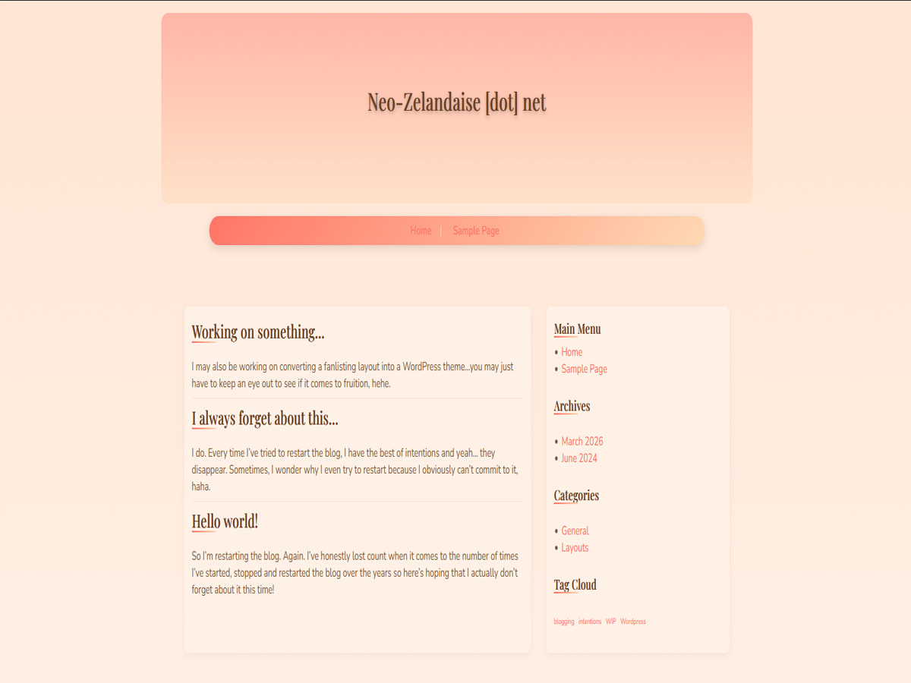

# Peachy Keen 🍑

Peachy Keen is a warm, soft-toned WordPress theme designed for personal blogs, with a focus on readability and a calm aesthetic.

---

## ✨ Features

* Responsive layout
* Sidebar with widgets
* Styled comment section
* Soft gradient header and navigation
* Clean, readable typography
* Tag and archive support

---

## 📦 Installation

1. Download or clone this repository
2. Upload the theme folder to:
   `/wp-content/themes/`
3. Go to **Appearance → Themes**
4. Activate **Peachy Keen**

---

## 📝 Notes

This theme was created as a personal project and refined for usability and consistency. It focuses on simplicity, warmth, and readability.

---

## 📜 License

Licensed under the GNU General Public License v2.0.

---

## 📅 Changelog

**v1.0**

* Initial release
